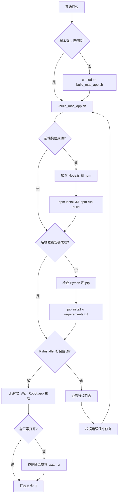

# macOS 应用打包指南

完整的 macOS 应用打包教程，将 TZ War Robot 打包成独立的 `.app` 应用程序。

---

## 🚀 快速开始（3步）

### 1️⃣ 打开终端

在项目目录中打开终端（Terminal）：
- 方式A：在 Finder 中右键项目文件夹，选择"服务" > "新建位于文件夹位置的终端窗口"
- 方式B：打开终端后，使用 `cd` 命令进入项目目录

### 2️⃣ 赋予脚本执行权限

```bash
chmod +x build_mac_app.sh
```

### 3️⃣ 运行打包脚本

```bash
./build_mac_app.sh
```

脚本会自动完成以下步骤：
- ✓ 构建前端资源
- ✓ 安装所有依赖
- ✓ 清理旧文件
- ✓ 打包成 .app 应用

---

## 📦 打包完成后

### 生成的文件位置

```
dist/
└── TZ_War_Robot.app/
    └── Contents/
        ├── MacOS/
        │   └── TZ_War_Robot (可执行文件)
        ├── Resources/
        └── Info.plist
```

### 应用大小

通常在 150-250 MB 之间（包含 Python 运行时和所有依赖）

---

## 🎮 运行应用

### 方式1：双击运行（推荐）

1. 打开 Finder
2. 进入项目的 `dist` 目录
3. 双击 `TZ_War_Robot.app`

### 方式2：从命令行运行

```bash
open dist/TZ_War_Robot.app
```

### 方式3：拖入应用程序文件夹

将 `TZ_War_Robot.app` 拖到 `/Applications` 文件夹，像其他 macOS 应用一样使用。

---

## 🔒 首次运行的安全提示

macOS 可能会显示安全警告："无法打开，因为它来自身份不明的开发者"

### 解决方法：

**方法A：系统偏好设置（推荐）**

1. 点击 Apple 菜单 () > 系统偏好设置
2. 点击"安全性与隐私"
3. 在"通用"标签页底部，点击"仍要打开"
4. 输入管理员密码确认

**方法B：右键菜单**

1. 按住 Control 键点击应用图标
2. 从菜单中选择"打开"
3. 在弹出对话框中点击"打开"

**方法C：终端命令**

```bash
# 移除隔离属性
xattr -cr dist/TZ_War_Robot.app

# 然后正常打开应用
open dist/TZ_War_Robot.app
```

---

## 🛠️ 详细打包步骤

如果自动脚本遇到问题，可以手动执行以下步骤：

### 步骤 1：安装依赖

```bash
# 如果需要，先开启代理加速下载
po

# 安装 Python 依赖
pip install -r backend/requirements.txt
pip install pyinstaller pywebview
```

### 步骤 2：构建前端

```bash
cd frontend

# 安装前端依赖（首次需要）
npm install

# 构建前端资源
npm run build

cd ..
```

### 步骤 3：清理旧文件

```bash
# 删除旧的构建文件
rm -rf build dist
```

### 步骤 4：执行打包

```bash
# 使用 PyInstaller 打包
pyinstaller TZ_Game.spec --clean --noconfirm
```

打包过程可能需要 3-5 分钟，请耐心等待。

---

## 📋 系统要求

### 打包环境要求

- **macOS**: 10.13 (High Sierra) 或更高版本
- **Python**: 3.7 - 3.11（推荐 3.9 或 3.10）
- **Node.js**: 14.x 或更高版本
- **磁盘空间**: 至少 2GB 可用空间
- **内存**: 建议 8GB 或以上

### 运行环境要求

打包后的应用可在以下系统运行：
- **macOS**: 10.13 或更高版本
- **架构**: Intel (x86_64) 和 Apple Silicon (arm64) 均支持

---

## 🎯 打包配置说明

### PyInstaller 配置文件

项目使用 `TZ_Game.spec` 配置文件，主要设置：

```python
# 入口文件
['app_launcher.py']

# 包含的数据文件
datas=[
    ('backend/*.py', 'backend'),      # 后端 Python 文件
    ('frontend/dist', 'frontend/dist'), # 前端构建产物
]

# 隐藏导入（确保所有依赖都被打包）
hiddenimports=[
    'flask', 'webview', 'requests',
    'backend.app', 'backend.game_logic',
    # ... 更多模块
]
```

### 关键配置项

- **console=False**: 无终端窗口，使用原生窗口
- **onefile**: 打包成单个可执行文件
- **upx=True**: 启用 UPX 压缩减小体积
- **bundle_identifier**: `com.tz.warrobot`

---

## ❓ 常见问题

### ❓ 脚本没有执行权限？

**问题**: 运行 `./build_mac_app.sh` 提示 "Permission denied"

**解决**:
```bash
chmod +x build_mac_app.sh
./build_mac_app.sh
```

### ❓ Python 版本不兼容？

**问题**: PyInstaller 不支持 Python 3.12+

**解决**:
```bash
# 检查 Python 版本
python --version

# 推荐使用 Python 3.9 或 3.10
# 如需安装特定版本，使用 pyenv：
brew install pyenv
pyenv install 3.10.13
pyenv local 3.10.13
```

### ❓ 前端构建失败？

**问题**: npm 依赖安装或构建错误

**解决**:
```bash
# 开启代理（如果需要）
po

# 清理并重新安装
cd frontend
rm -rf node_modules package-lock.json
npm install
npm run build
cd ..
```

### ❓ PyInstaller 找不到？

**问题**: `pyinstaller: command not found`

**解决**:
```bash
# 安装 PyInstaller
pip install pyinstaller

# 或使用国内镜像加速
pip install -i https://pypi.tuna.tsinghua.edu.cn/simple pyinstaller
```

### ❓ 打包后应用无法启动？

**问题**: 双击 .app 没有反应或闪退

**排查步骤**:

1. **从终端运行查看错误**:
   ```bash
   ./dist/TZ_War_Robot.app/Contents/MacOS/TZ_War_Robot
   ```

2. **查看系统日志**:
   ```bash
   log show --predicate 'process == "TZ_War_Robot"' --last 5m
   ```

3. **检查前端是否构建**:
   ```bash
   ls -la frontend/dist
   # 应该包含 index.html 等文件
   ```

4. **重新打包时使用 debug 模式**:
   ```bash
   # 修改 TZ_Game.spec 中的 debug=True
   # 然后重新打包
   ```

### ❓ 应用体积太大？

**问题**: .app 文件超过 300MB

**优化方法**:

1. **确保 UPX 已安装**:
   ```bash
   brew install upx
   ```

2. **排除不必要的库**:
   编辑 `TZ_Game.spec`，在 `excludes` 列表中添加不需要的包

3. **清理 Python 缓存**:
   ```bash
   find . -type d -name __pycache__ -exec rm -r {} +
   find . -type f -name "*.pyc" -delete
   ```

### ❓ Apple Silicon Mac 兼容性？

**问题**: 在 M1/M2/M3 Mac 上运行报错

**解决**:

使用原生 arm64 版本的 Python（不要使用 Rosetta）:
```bash
# 检查 Python 架构
python -c "import platform; print(platform.machine())"
# 应该显示 'arm64' 而不是 'x86_64'

# 如果是 x86_64，需要安装 arm64 版本的 Python
# 推荐使用 Homebrew 安装
arch -arm64 brew install python@3.10
```

### ❓ 如何代码签名？

**问题**: 想要发布给其他用户使用

**解决**:

1. **注册 Apple Developer**（需要付费）

2. **获取签名证书**:
   - 在 Xcode 中创建开发者证书
   - 或使用 Developer Portal 创建

3. **签名应用**:
   ```bash
   # 查看可用的签名身份
   security find-identity -v -p codesigning
   
   # 签名应用
   codesign --deep --force --sign "Developer ID Application: Your Name" \
            dist/TZ_War_Robot.app
   
   # 验证签名
   codesign --verify --verbose dist/TZ_War_Robot.app
   ```

4. **公证应用**（macOS 10.15+）:
   ```bash
   # 打包为 dmg
   hdiutil create -volname "TZ War Robot" -srcfolder dist/TZ_War_Robot.app \
                  -ov -format UDZO TZ_War_Robot.dmg
   
   # 提交公证
   xcrun notarytool submit TZ_War_Robot.dmg \
                   --apple-id "your@email.com" \
                   --team-id "TEAM_ID" \
                   --password "app-specific-password"
   ```

---

## 📦 分发应用

### 方式1：直接分发 .app

将 `dist/TZ_War_Robot.app` 压缩：

```bash
cd dist
zip -r TZ_War_Robot.zip TZ_War_Robot.app
```

用户下载后解压即可使用。

### 方式2：创建 DMG 镜像（推荐）

```bash
# 安装 create-dmg（首次需要）
brew install create-dmg

# 创建 DMG
create-dmg \
  --volname "TZ War Robot" \
  --volicon "icon.icns" \
  --window-pos 200 120 \
  --window-size 800 400 \
  --icon-size 100 \
  --icon "TZ_War_Robot.app" 200 190 \
  --hide-extension "TZ_War_Robot.app" \
  --app-drop-link 600 185 \
  "TZ_War_Robot.dmg" \
  "dist/"
```

用户双击 DMG 后，可以将应用拖入应用程序文件夹。

### 方式3：使用 GitHub Releases

1. 创建 release tag
2. 上传 .app.zip 或 .dmg 文件
3. 添加发布说明

---

## 🔍 故障排除流程图



---

## 📝 打包检查清单

在开始打包前，请确认：

- [ ] Python 版本在 3.7-3.11 之间
- [ ] Node.js 已安装（`node --version`）
- [ ] 前端已成功构建（`frontend/dist` 目录存在）
- [ ] 后端依赖已安装（`pip list | grep flask`）
- [ ] PyInstaller 已安装（`pyinstaller --version`）
- [ ] 有足够的磁盘空间（至少 2GB）
- [ ] 网络连接正常（如需下载依赖）

---

## 💡 最佳实践

### 1. 使用虚拟环境

```bash
# 创建虚拟环境
python -m venv venv

# 激活虚拟环境
source venv/bin/activate

# 安装依赖
pip install -r backend/requirements.txt
pip install pyinstaller pywebview

# 打包
./build_mac_app.sh

# 完成后退出
deactivate
```

**优势**: 隔离依赖，避免版本冲突，减小打包体积。

### 2. 定期清理构建缓存

```bash
# 清理 Python 缓存
find . -type d -name __pycache__ -exec rm -r {} +
find . -type f -name "*.pyc" -delete

# 清理构建文件
rm -rf build dist

# 清理前端
cd frontend && rm -rf node_modules/.cache && cd ..
```

### 3. 版本管理

在 `TZ_Game.spec` 中更新版本号：

```python
info_plist={
    'CFBundleShortVersionString': '1.0.1',  # 更新这里
    'CFBundleVersion': '1.0.1',
    # ...
}
```

### 4. 测试不同 macOS 版本

- 在不同版本的 macOS 上测试打包的应用
- 在 Intel 和 Apple Silicon Mac 上都测试
- 检查不同屏幕分辨率下的显示效果

---

## 🚀 自动化打包

### 使用 GitHub Actions

创建 `.github/workflows/build-mac.yml`:

```yaml
name: Build macOS App

on:
  push:
    tags:
      - 'v*'

jobs:
  build:
    runs-on: macos-latest
    
    steps:
    - uses: actions/checkout@v3
    
    - name: Set up Python
      uses: actions/setup-python@v4
      with:
        python-version: '3.10'
    
    - name: Set up Node.js
      uses: actions/setup-node@v3
      with:
        node-version: '18'
    
    - name: Build
      run: |
        chmod +x build_mac_app.sh
        ./build_mac_app.sh
    
    - name: Create DMG
      run: |
        brew install create-dmg
        create-dmg --volname "TZ War Robot" \
                   --app-drop-link 600 185 \
                   "TZ_War_Robot.dmg" "dist/"
    
    - name: Upload Release
      uses: softprops/action-gh-release@v1
      with:
        files: TZ_War_Robot.dmg
```

---

## 📚 相关文档

- [Windows 打包指南](./QUICK_START.md)
- [项目 README](./README.md)
- [PyInstaller 官方文档](https://pyinstaller.org/)
- [macOS 代码签名指南](https://developer.apple.com/documentation/security/notarizing_macos_software_before_distribution)

---

## 📞 获取帮助

如果遇到问题：

1. **查看日志**: 检查终端输出的错误信息
2. **搜索 Issues**: 在项目 GitHub Issues 中搜索类似问题
3. **创建 Issue**: 提供详细的错误信息、系统版本、Python 版本等
4. **Discord/论坛**: 加入社区讨论

---

## ✅ 打包成功标志

看到以下输出表示打包成功：

```
==========================================
✅ 打包成功！
==========================================

应用位置: /path/to/project/dist/TZ_War_Robot.app

📝 使用说明：
1. 打开 Finder，导航到 dist 目录
2. 双击 TZ_War_Robot.app 运行
3. 如果遇到安全提示，请到 系统偏好设置 > 安全性与隐私 中允许运行

💡 提示：
- 可以将 .app 拖到 应用程序 文件夹
- 首次运行可能需要几秒钟启动

应用大小: 200M
```

---

**祝您打包顺利！🎉 享受与 TZ 的对话之旅！** 🤖✨
