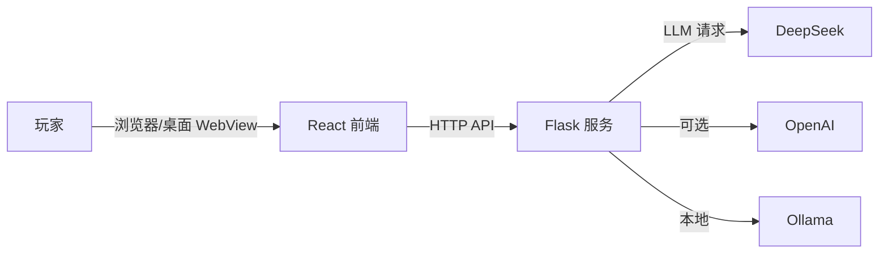
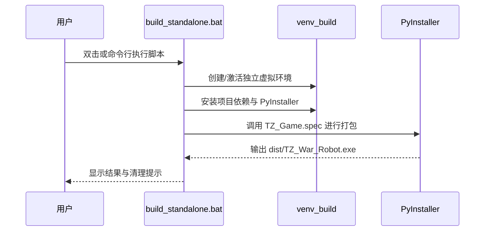

# TZ - 失落的战斗机器人（中文指南）

## 1. 项目概述
TZ - The Lost War Robot 是一款结合文字冒险与即时交互的解谜体验。玩家通过与失忆的战斗机器人 TZ 对话，逐步恢复其记忆、修复系统模块，并根据抉择解锁多结局。

## 2. 核心玩法亮点
- **智能对话系统**：基于 LLM 的 NPC 对话逻辑，可呈现多情绪、多人格切换。
- **多样化技术谜题**：涵盖路径规划、频率调谐、密码破译与逻辑推理等挑战。
- **分支叙事**：根据玩家选择触发不同剧情走向与结局。
- **记忆碎片系统**：动态生成背景记忆，强化沉浸感。
- **现代化 GUI**：Tkinter 打造的聊天窗口，配有气泡、打字机与系统状态提示。

## 3. 技术架构
- **后端**：Python / Flask + Flask-CORS + Requests，负责 REST API、状态管理、LLM 通信。
- **前端**：React + Vite 构建的单页页面，内置 HUD、提示音、消息队列等交互细节。
- **AI 接入**：支持 DeepSeek、OpenAI、Ollama（本地）等多数据源，配置灵活。
- **打包方式**：PyInstaller + 独立虚拟环境，产出单个可执行文件。



## 4. 目录结构（核心）
```
YI_Ding_FINAL/
├── backend/           # Flask API 与游戏逻辑
├── frontend/          # React 客户端源码
├── dist/              # 打包输出，生成 TZ_War_Robot.exe
├── build_standalone.bat  # Windows 独立环境打包脚本
├── TZ_Game.spec       # PyInstaller 配置
├── README.md          # 英文说明
├── Readme_CN.md       # 本文件
└── QUICK_START.md     # 打包快速指引
```

## 5. 本地运行（开发模式）
1. **准备虚拟环境**
   ```powershell
   python -m venv tz-env
   .\tz-env\Scripts\activate
   ```
2. **安装依赖**
   ```powershell
   pip install -r backend\requirements.txt
   cd frontend
   npm install
   npm run build   # 生成 frontend/dist
   cd ..
   ```
3. **配置 API**：在 `backend` 中设置所选 LLM 的 API Key 与 Base URL。
4. **启动服务**
   ```powershell
   cd backend
   python app.py
   ```
   访问 `http://localhost:5001` 即可体验。

## 6. Windows 打包指南
### 6.1 前置条件
- Windows 10/11
- Python 3.10+（已加入 PATH）
- 前端已执行 `npm run build`，确保 `frontend/dist` 存在
- 足够的磁盘空间（>1GB）

### 6.2 一键打包（推荐）
1. 在项目根目录打开 PowerShell 或 CMD。
2. 运行 `build_standalone.bat`。
3. 等待脚本自动完成以下步骤：
   - 检查 Python 环境、升级 `pip`
   - 创建独立虚拟环境 `venv_build`
   - 安装 `backend/requirements.txt` 与 `pyinstaller`
   - 清理旧的 `build/`、`dist/`
   - 使用 `TZ_Game.spec` 打包，生成 `dist/TZ_War_Robot.exe`
4. 完成后命令行会显示可执行文件大小，并提示是否保留 `venv_build` 以便下次复用。



### 6.3 手动打包（可选）
1. 手动创建并激活虚拟环境。
2. 安装依赖：`pip install -r backend/requirements.txt && pip install pyinstaller`。
3. 执行 `pyinstaller --clean --noconfirm TZ_Game.spec`。
4. 在 `dist/` 目录获取最终可执行文件。

### 6.4 常见问题
| 问题 | 解决方案 |
| --- | --- |
| PowerShell 禁止执行脚本 | `Set-ExecutionPolicy -ExecutionPolicy RemoteSigned -Scope CurrentUser` |
| 前端资源缺失 | 重新进入 `frontend/` 执行 `npm run build` |
| 打包失败提示缺少依赖 | 删除 `venv_build` 并重新运行脚本，或检查 `backend/requirements.txt` |
| EXE 启动报错 API Key | 确保 `.env` 或配置文件中已有有效密钥 |

## 7. 运行与发布
- **本地体验**：直接运行 `dist/TZ_War_Robot.exe`（首次启动略慢）。
- **分发方式**：将 `dist/TZ_War_Robot.exe` 提供给玩家即可，无需额外依赖。
- **建议**：与 EXE 同步提供 `使用说明` 与 API Key 配置指导。

## 8. 故障排除与支持
- 网络/LLM 链路异常：检查代理、密钥与所选 API 基础地址。
- 字体或中文显示问题：确认系统启用 UTF-8，必要时更新字体文件。
- 若需更多帮助，可参考 `QUICK_START.md` 或联系项目维护者。
